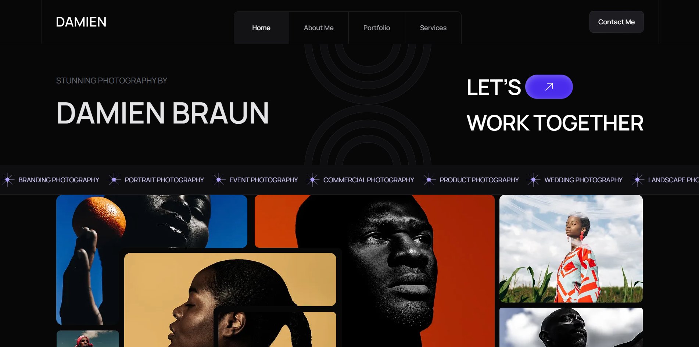

# 📸 Damien Braun - Photography Portfolio

Современный сайт-портфолио фотографа Damien Braun

## 🖼️ Дизайн

Бесплатный макет из Figma.



🔗 [Ссылка на макет в Figma](https://www.figma.com/design/25mNfb47TbdjLw9rZiAzKU/Photographer-Portfolio-Website-UI-Template---Dark-Theme-%7C-Produce-UI--Community-?t=t6noC0sOaTuonFzC-0)

## 🛠️ Стек

- **[Minista](https://minista.qranoko.jp/)** - SSG на базе Vite с JSX-компонентами
- **Vite** - сборщик и dev-сервер
- **SCSS** - препроцессор для стилей
- **JavaScript**
- **GSAP** - анимации
- **Lenis** - плавный скролл
- **Swiper** - слайдеры
- **ESLint / Stylelint / Prettier** - линтинг и форматирование JS и стилей

## ✨ Реализовано

- Компонентный подход с переиспользуемыми JSX-компонентами
- Адаптивная верстка под разные разрешения экрана
- Анимации на `GSAP`
- Плавный скролл с `Lenis`
- Слайдеры на `Swiper`
- Валидация формы на `JavaScript`
- Настроенный линтинг и форматирование кода

## 🚀 Запуск

### 🌐 Онлайн

🔗 [Открыть сайт](https://daniltyrtychnyi.github.io/damien-portfolio/)

### 💻 Локально

**1. Клонируйте репозиторий**

```bash
git clone git@github.com:daniltyrtychnyi/damien-portfolio.git
```

**2. Установите зависимости**

```bash
npm install
```

**3. Запустите проект в режиме разработки**

```bash
npm start
```

После запуска Vite выведет локальный адрес в терминале.

**📦 Production-сборка**

```bash
npm run build
```

Собранный проект находится в папке `dist`.

Для локального просмотра production-версии:

```bash
npm run preview
```
